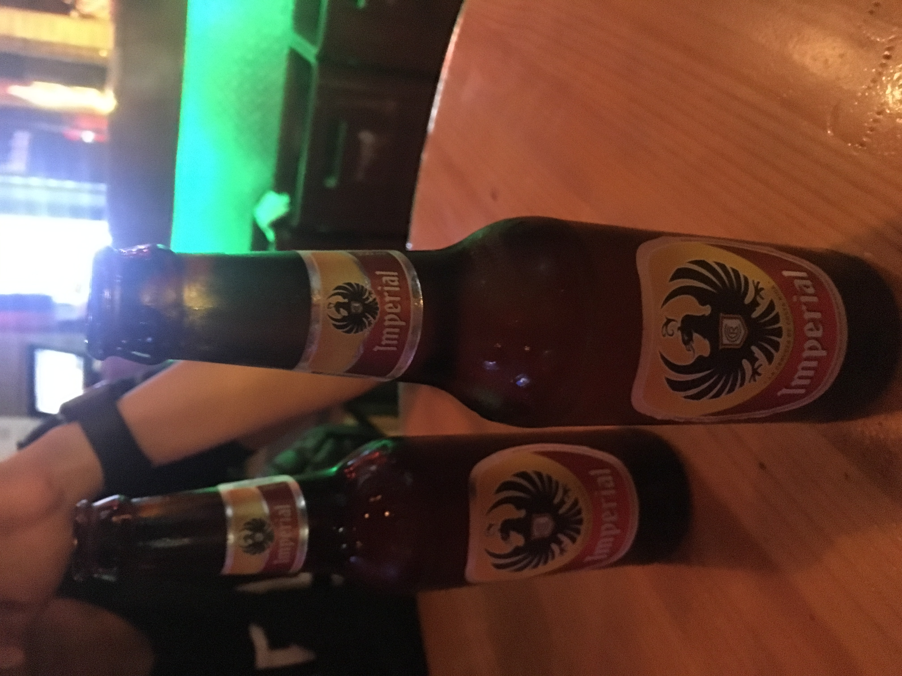
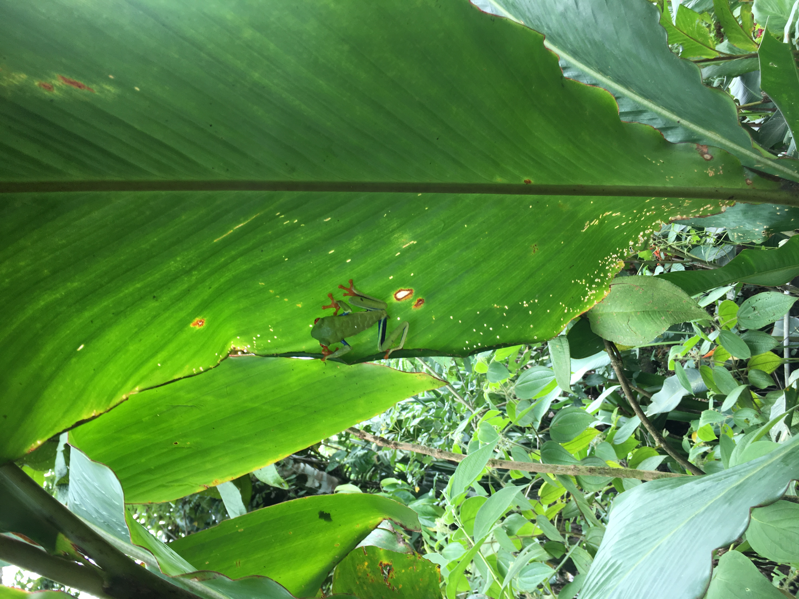
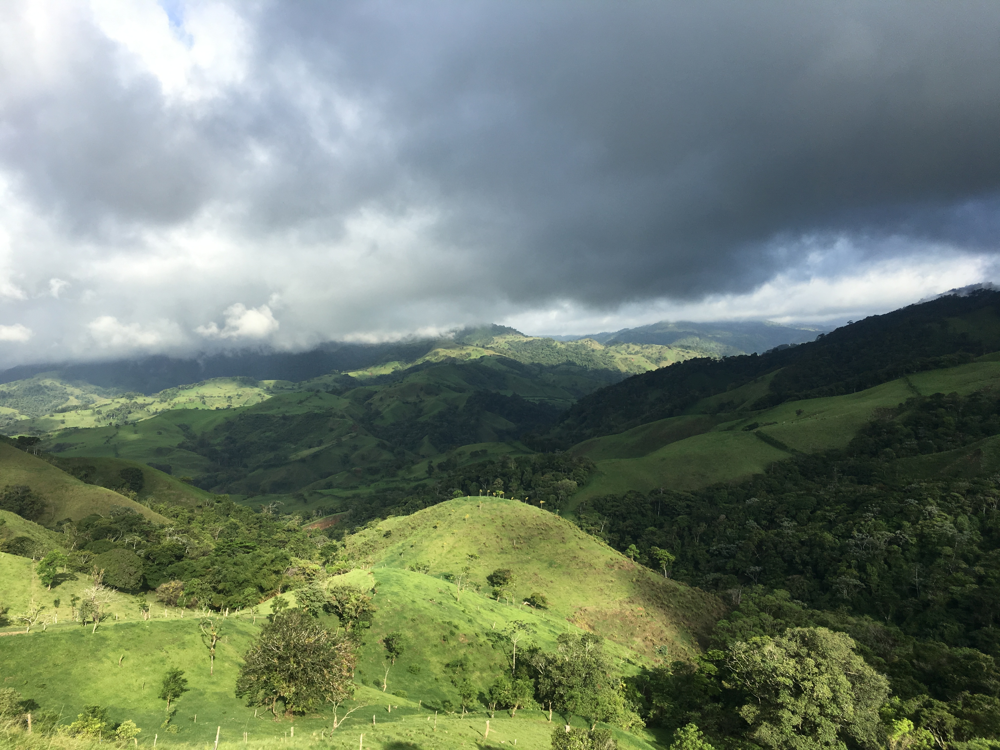
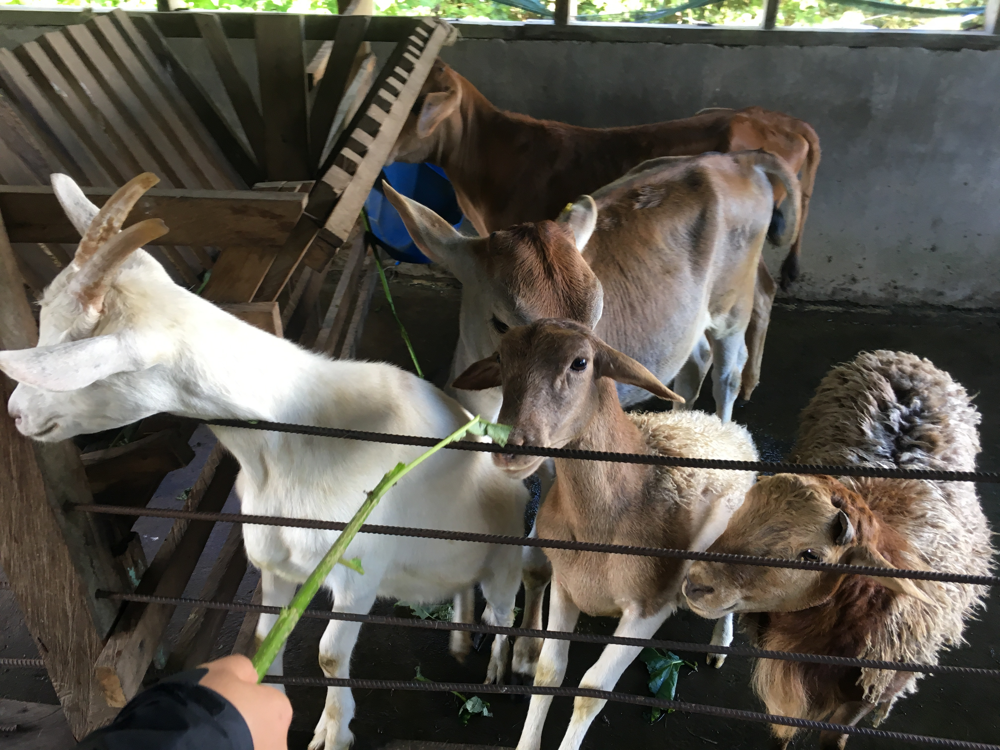

## Prague

I studied abroad at NYU Prague my Sophomore year. With a relatively lighter courseload and the Czech Republic's central location, I was able to travel across Europe.

## Hong Kong

My Senior year, I participated in IBEX, an International Business EXchange program with the Hong Kong University of Science and Technology (HKUST). If you're ever in Hong Kong, I highly highly highly recommend vising the campus and the nearby Sai Kung area. It's beautiful!

## Post Graduation 

After graduation college, I went on a post-grad trip.

### Costa Rica

